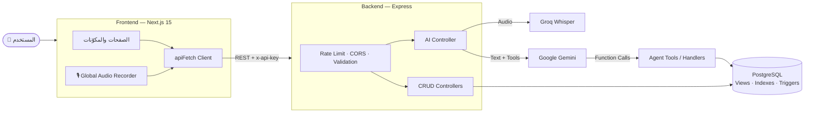
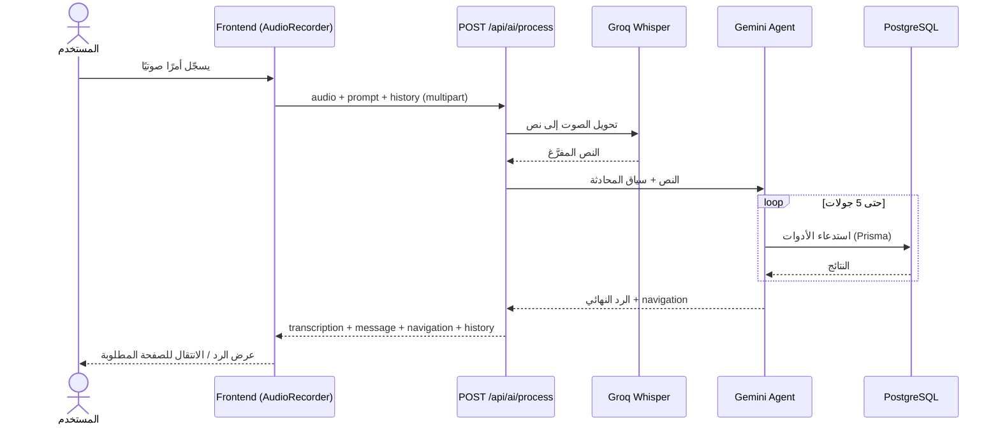
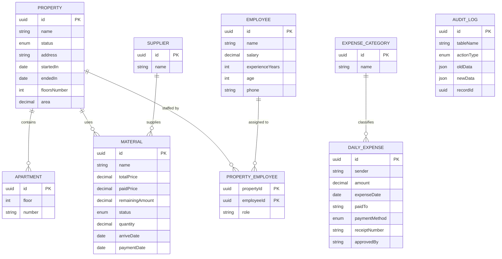

<div align="center">

# 🏗️ REC Company

### نظام متكامل لإدارة العقارات والمقاولات — مع مساعد ذكي بالصوت والنص

لوحة تحكم عصرية لإدارة العقارات والموظفين والموردين والمواد والمصروفات،
مدعومة بمساعد ذكاء اصطناعي ينفّذ أوامرك الصوتية بالعربية مباشرة على بيانات النظام.


</div>

<div dir="rtl">

## 📑 المحتويات

- [نظرة عامة](#-نظرة-عامة)
- [المميزات](#-المميزات)
- [التقنيات المستخدمة](#-التقنيات-المستخدمة)
- [معمارية النظام](#-معمارية-النظام)
- [المساعد الذكي والأوامر الصوتية](#-المساعد-الذكي-والأوامر-الصوتية)
- [نموذج البيانات](#-نموذج-البيانات)
- [واجهات الـ API](#-واجهات-الـ-api)
- [هيكل المشروع](#-هيكل-المشروع)
- [التشغيل السريع](#-التشغيل-السريع)
- [متغيرات البيئة](#-متغيرات-البيئة)
- [قيد التطوير](#-قيد-التطوير)

---

## 🌟 نظرة عامة

**REC Company** نظام لإدارة عمليات شركة عقارات ومقاولات من مكان واحد. يتكوّن من:

| الجزء | الوصف |
|---|---|
| **Frontend** | تطبيق Next.js (App Router) بواجهة داكنة عصرية تعرض العقارات، الموظفين، الموردين، المواد، المصروفات وسجل التدقيق. |
| **Backend** | REST API مبني بـ Express و Prisma فوق PostgreSQL، مع طبقة ذكاء اصطناعي (Gemini) وتحويل الصوت إلى نص (Whisper). |

الفكرة الأساسية: بدل التنقل بين الشاشات وتعبئة النماذج، اضغط زر المايك وقل مثلاً
*«كم إجمالي ديون الموردين؟»* أو *«سجّل مصروف بقيمة 500 جنيه»* أو *«افتح صفحة الموظفين»* — وسيفهمك النظام وينفّذ.

---

## ✨ المميزات

### 🏢 إدارة العقارات والوحدات
- إضافة العقارات وتعديلها وحذفها مع حالة كل عقار (**مكتمل** / **قيد الإنشاء**).
- بيانات تفصيلية لكل عقار: العنوان، المساحة، عدد الأدوار، تاريخ البدء والانتهاء.
- إدارة **الشقق** التابعة لكل عقار (الدور + رقم الشقة) مع منع التكرار داخل العقار الواحد.
- فلترة وبحث متقدم: بالحالة، المساحة (من/إلى)، نطاق التواريخ، والترتيب — عبر `searchParams` بروابط قابلة للمشاركة.
- تحديث العقار وعلاقاته (الشقق + الموظفين المعيّنين) داخل **Transaction واحدة** لضمان اتساق البيانات.

### 👷 إدارة الموظفين
- سجل كامل للموظفين: الراتب، سنوات الخبرة، السن، الهاتف.
- **تعيين الموظفين على العقارات** بدور محدد لكل موظف (علاقة Many-to-Many).
- استعراض فريق العمل الخاص بأي عقار.

### 🚚 الموردون والمواد والمديونيات
- تتبّع المواد الموردة لكل عقار: السعر الكلي، المدفوع، الكمية، تاريخ الوصول.
- **حساب تلقائي للمتبقي** (`remainingAmount`) وتاريخ سداد افتراضي بعد شهر من الوصول.
- حالة الدفع لكل مادة (**مدفوع** / **آجل**).
- **ملخص المديونيات**: إجمالي الدين على الشركة، ودين كل مورد على حدة، مع فلتر «الموردون أصحاب الديون فقط».
- استعلامات الديون تعتمد على **Database Views** و **Covering Indexes** لسرعة عالية.

### 💸 المصروفات اليومية
- تسجيل المصروفات مع التصنيف، المستلم، وطريقة الدفع (`CASH` / `credit_card` / `BANK_TRANSFER` / `CHECK` / `PETTY_CASH`).
- دعم رقم الإيصال وصورته، والمعتمِد، والملاحظات.
- إدارة **تصنيفات المصروفات** بشكل مستقل.
- عرض المصروفات مرتبة بالتاريخ (الأحدث أولاً).

### 🧾 سجل التدقيق (Audit Log)
- تسجيل **تلقائي على مستوى قاعدة البيانات** (PostgreSQL Triggers) لكل عملية `INSERT` / `UPDATE` / `DELETE`.
- يحفظ **القيمة القديمة والجديدة** بصيغة JSON لكل سجل، مما يتيح معرفة من غيّر ماذا ومتى.
- يعمل بغض النظر عن مصدر التعديل (الواجهة، الـ API، أو المساعد الذكي).
- تحديث `updated_at` تلقائيًا عبر Triggers.

### 🤖 المساعد الذكي (AI Agent)
- **أوامر صوتية بالعربية** عبر زر تسجيل عائم متاح في كل صفحات النظام.
- يدعم **الإدخال النصي والصوتي** معًا، مع إمكانية إرفاق ملف JSON لسياق المحادثة السابقة.
- **38 أداة (Function Calling)** تغطي كل موارد النظام: قراءة، إضافة، تعديل، حذف، واستعلامات الديون.
- **تنقّل ذكي في الواجهة**: قل «افتح المصروفات» وسينتقل التطبيق للصفحة تلقائيًا.
- **تأكيد قبل الحذف**: التعليمات النظامية تُلزم المساعد بطلب موافقة المستخدم قبل أي عملية حذف.
- **مقاومة الأخطاء**: تبديل تلقائي بين عدة نماذج Gemini عند فشل أحدها.
- **بحث مرن بالأسماء**: يتعامل مع اختلافات الهمزة والمسافات عند مطابقة أسماء الموردين والعقارات.
- **سجل محادثات** المساعد يُحفظ كملفات JSON ويُعرض في صفحة `/ai-chat`.

### 🎨 تجربة المستخدم
- تصميم داكن بلمسات **Teal** مع خلفية ضبابية هادئة (ambient glows).
- واجهة متجاوبة (Navbar علوي + قائمة جانبية للإجراءات السريعة + Footer).
- مكوّنات قابلة لإعادة الاستخدام: `EntityPage` (جدول + تعديل + حذف + Pagination) و `RecordForm` (نماذج ديناميكية بحقول شرطية).
- Pagination وبحث وترتيب في كل الجداول.

### 🔐 الأمان والأداء
- حماية الـ API بمفتاح `x-api-key` (اختياري ومُفعّل بمتغير بيئة).
- **Rate Limiting**: 300 طلب لكل 15 دقيقة.
- **CORS** مقيّد بقائمة أصول مسموحة.
- التحقق الصارم من المدخلات (UUID + الحقول المطلوبة) وحد أقصى لحجم JSON (1MB) والملفات الصوتية (25MB).
- حماية مسارات الملفات الصوتية من **Path Traversal**.
- تحويل أخطاء Prisma (التكرار، المفاتيح الأجنبية) إلى ردود `400` / `409` مفهومة.
- إيقاف آمن للخادم (**Graceful Shutdown**) مع غلق اتصال قاعدة البيانات.
- استجابات موحّدة بصيغة `{ data, pagination }`.

---

## 🛠️ التقنيات المستخدمة

### Frontend

| التقنية | الاستخدام |
|---|---|
| **Next.js 15** (App Router) | إطار العمل الرئيسي، Server Components و Server Actions |
| **React 19** | بناء واجهة المستخدم |
| **TypeScript 5.8** | Type Safety في كل التطبيق (types لكل كيان) |
| **Tailwind CSS v4** | التنسيق والتصميم |
| **lucide-react** | الأيقونات |
| **MediaRecorder API** | تسجيل الصوت من المتصفح (WebM / MP4 / OGG / WAV) |
| طبقة `apiFetch` مخصصة | عميل موحّد للـ API (Query Params، JSON، FormData، `x-api-key`) |

### Backend

| التقنية | الاستخدام |
|---|---|
| **Node.js** (ES Modules) | بيئة التشغيل |
| **Express 4** | REST API |
| **Prisma 6** | ORM والـ Migrations والـ Seeding |
| **PostgreSQL** | قاعدة البيانات (Views، Indexes، Triggers) |
| **Multer** | استقبال الملفات الصوتية و JSON |
| **express-rate-limit** | الحد من الطلبات |
| **cors** · **morgan** · **dotenv** | CORS، تسجيل الطلبات، متغيرات البيئة |
| **ESLint** | جودة الكود |

### الذكاء الاصطناعي

| التقنية | الاستخدام |
|---|---|
| **Google Gemini** (`@google/genai`) | العقل المدبّر للمساعد + Function Calling |
| **Groq — Whisper Large v3** | تحويل الكلام (عربي/إنجليزي) إلى نص بسرعة عالية |

---

## 🧩 معمارية النظام



---

## 🎙️ المساعد الذكي والأوامر الصوتية



**أمثلة على الأوامر:**

| ما تقوله | ما يحدث |
|---|---|
| «افتح صفحة الموردين» | تنقّل تلقائي إلى `/suppliers` |
| «كم إجمالي الديون المستحقة للموردين؟» | استعلام من View الديون وعرض الرقم |
| «أضف عقار جديد اسمه برج النخيل، 12 دور» | إنشاء العقار في قاعدة البيانات |
| «سجّل مصروف 500 جنيه نقدًا لصالح…» | إضافة مصروف يومي جديد |
| «احذف المورد …» | يطلب منك التأكيد أولاً ثم ينفّذ |

**تفاصيل التنفيذ:**
- حلقة استدعاء أدوات بحد أقصى **5 جولات** لكل طلب، ودرجة حرارة منخفضة (`0.2`) للدقة في البيانات المالية.
- اقتطاع ذكي لسياق المحادثة (آخر 24 رسالة للنموذج) مع الحفاظ على سلامة تسلسل الأدوار.
- عند فشل أداة، يُبلَّغ المستخدم بوضوح **دون اختلاق بيانات**.
- الانتقال بين الصفحات يقتصر على قائمة مسارات مسموحة في الواجهة.

---

## 🗄️ نموذج البيانات



**عناصر قاعدة البيانات الإضافية (SQL):**
- `v_suppliers_with_debt` — إجمالي الدين لكل مورد.
- `v_supplier_materials` — تفاصيل مواد كل مورد.
- `v_daily_expenses_ordered_by_date` — المصروفات مرتبة بالتاريخ.
- Triggers لـ `updated_at` وسجل التدقيق على جميع الجداول الرئيسية.

---

## 🔌 واجهات الـ API

المسار الأساسي: `/api` — ويوجد `GET /health` للفحص (بدون مفتاح).
مجموعة **Postman** جاهزة داخل المستودع: `Real Estate Management API.postman_collection.json`.

| المورد | المسار | العمليات |
|---|---|---|
| العقارات | `/api/properties` | CRUD + `GET /:id/employees` + فلاتر (الحالة، المساحة، التواريخ، البحث، الترتيب) |
| الشقق | `/api/apartments` | CRUD |
| الموظفون | `/api/employees` | CRUD + بحث وPagination |
| الموردون | `/api/suppliers` | CRUD + `GET /total_debt` + `GET /details` + `GET /:id/total_debt` + `has_debt` |
| المواد | `/api/materials` | CRUD |
| المصروفات | `/api/expenses` | CRUD + ترتيب حسب التاريخ |
| تصنيفات المصروفات | `/api/expense_categories` | CRUD |
| سجل التدقيق | `/api/audit-logs` | قراءة فقط |
| المساعد الذكي | `/api/ai/process` | نص و/أو صوت + history → رد + navigation |
| المساعد الذكي | `/api/ai/analyze-stored-audio` | تحليل تسجيل محفوظ على الخادم |
| النسخ الصوتي | `/api/voice-assistant/process` | تحويل الصوت إلى نص فقط |

---

## 📂 هيكل المشروع

```text
Properties-company-system-backend/
├── prisma/
│   ├── schema.prisma            # نموذج البيانات
│   ├── migrations/              # Prisma migrations
│   └── seed.js                  # Views + Triggers + Seeding
├── src/
│   ├── ai/
│   │   ├── agentService.js      # منسّق الـ Agent (Gemini + tool loop + fallback)
│   │   ├── AI_Models/           # قائمة النماذج
│   │   └── tools/
│   │       ├── definitions.js   # تعريف الأدوات (38 أداة)
│   │       └── handlers.js      # تنفيذ الأدوات على قاعدة البيانات
│   ├── controllers/             # CRUD + AI + Voice controllers
│   ├── routes/                  # مسارات الـ API
│   ├── middleware/              # API key + Validation
│   ├── db/migrations/           # SQL: Views/Indexes + Audit Triggers
│   ├── app.js                   # إعداد Express
│   └── index.js                 # نقطة التشغيل
└── Real Estate Management API.postman_collection.json

Properties-company-system-Frontend/
├── app/
│   ├── page.tsx                 # لوحة العقارات + الفلاتر
│   ├── [propertyID]/            # تفاصيل وتعديل العقار
│   ├── properties/new/          # إضافة عقار (Server Action)
│   ├── employees/  suppliers/  materials/  expenses/
│   ├── audit-logs/              # سجل التدقيق
│   └── ai-chat/                 # سجل محادثات المساعد
├── components/
│   ├── common/                  # EntityPage, RecordForm, AudioRecorder…
│   ├── layout/                  # Navbar, Sidebar, Footer
│   ├── properties/  suppliers/  expenses/  audit/  Filters/
├── lib/api/                     # طبقة الاتصال بالـ Backend
├── actions/                     # Server Actions
└── types/                       # TypeScript types
```

---

## 🚀 التشغيل السريع

**المتطلبات:** Node.js 20+ ، PostgreSQL ، مفتاح **Gemini API** ، ومفتاح **Groq API** (للأوامر الصوتية).

### 1) الـ Backend

```bash
cd Properties-company-system-backend
cp .env.example .env          # عدّل القيم (انظر الجدول أدناه)
npm install
npx prisma generate
npx prisma migrate deploy     # أو: npm run prisma:migrate أثناء التطوير
npx prisma db seed            # إنشاء الـ Views والـ Triggers
npm run dev                   # http://localhost:6000
```

> بدلاً من الـ seed يمكنك تنفيذ ملفَّي `src/db/migrations/001_views_and_indexes.sql` و `002_audit_triggers.sql` يدويًا على نفس قاعدة البيانات.

### 2) الـ Frontend

```bash
cd Properties-company-system-Frontend
cp .env.example .env.local
npm install
npm run dev                   # http://localhost:3000
```

---

## ⚙️ متغيرات البيئة

### Backend (`.env`)

| المتغير | مطلوب | الوصف |
|---|:---:|---|
| `DATABASE_URL` | ✅ | رابط اتصال PostgreSQL |
| `GEMINI_API_KEY` | ✅ | مفتاح Google Gemini (الخادم لا يعمل بدونه) |
| `GROQ_API_KEY` | للصوت | مفتاح Groq لتحويل الصوت إلى نص |
| `PORT` | ❌ | المنفذ (الافتراضي `6000`) |
| `FRONTEND_URL` | ❌ | أصل الواجهة المسموح به في CORS (بالإضافة إلى `localhost:3000`) |
| `API_KEY` | ❌ | إن وُجد، تصبح كل مسارات `/api` تتطلب الهيدر `x-api-key` |
| `GROQ_STT_MODEL` | ❌ | نموذج النسخ الصوتي (الافتراضي `whisper-large-v3`) |

### Frontend (`.env.local`)

| المتغير | مطلوب | الوصف |
|---|:---:|---|
| `NEXT_PUBLIC_API_URL` | ✅ | رابط الـ API، مثال: `http://localhost:6000/api` |
| `NEXT_PUBLIC_API_KEY` | ❌ | يُستخدم فقط إن كان `API_KEY` مفعّلاً في الـ Backend (⚠️ يظهر للمتصفح) |

---

## 🧭 قيد التطوير

- ربط جدول **سجل التدقيق** في الواجهة ببيانات الـ API.
- استكمال عمليتَي الحفظ والحذف من صفحة **المصروفات** في الواجهة.

---

<div align="center">

صُنع بـ ❤️ لإدارة عقارية أذكى

</div>

</div>
